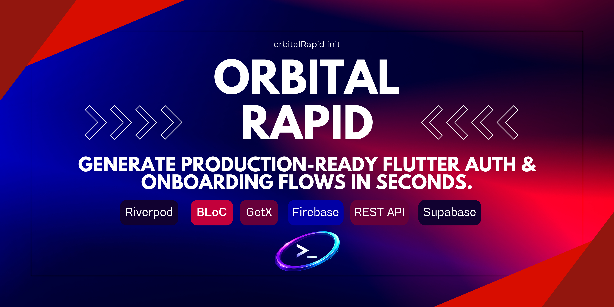
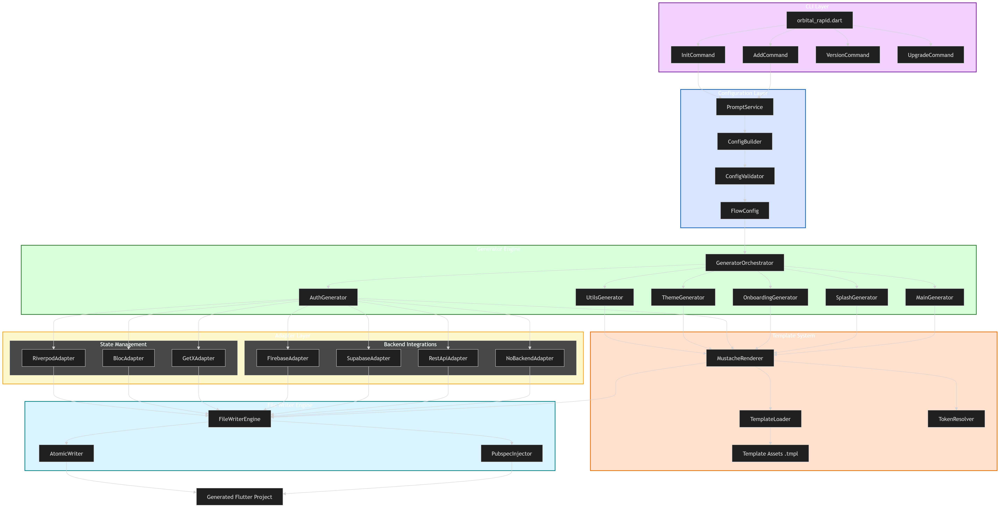

<p align="center">
  
</p>

# 🚀 Orbital Rapid CLI

<p align="center">
  
</p>

<p align="center">
  <a href="https://pub.dev/packages/orbital_rapid_cli">
    
  </a>
  <a href="https://pub.dev/packages/orbital_rapid_cli">
    
  </a>
  <a href="https://pub.dev/packages/orbital_rapid_cli">
    
  </a>
  <a href="https://github.com/bonyyamin/orbital_rapid_cli/actions">
    
  </a>
  <a href="https://opensource.org/licenses/MIT">
    
  </a>
  <a href="https://github.com/bonyyamin/orbital_rapid_cli/stargazers">
    
  </a>
</p>

<p align="center">
  <strong>Generate production-ready Flutter auth & onboarding flows in seconds.</strong><br/>
  Supports Riverpod · BLoC · GetX · Firebase · REST API · Supabase
</p>

---

## ✨ What Is This?

**Orbital Rapid CLI** is a command-line tool that scaffolds complete, production-ready Flutter application flows — splash, onboarding, login, registration, forgot password, logout, and account deletion — with your chosen state management and backend, in a single command.

<p align="center">
  
</p>

No more copy-pasting boilerplate. No more spending the first week of every project writing the same screens.

```bash
orbitalRapid init
```

```
? Project name: awesome_app
? Package name: com.mycompany.awesome_app
? State management: Riverpod
? Backend: Firebase
? Screens: Splash, Onboarding, Login, Register, Forgot Password, Account Deletion
? Dark mode support: Yes
? Localization ready: Yes

⠸ Generating project structure...    ✅
⠸ Generating core utils...           ✅
⠸ Generating theme system...         ✅
⠸ Generating splash screen...        ✅
⠸ Generating onboarding flow...      ✅
⠸ Generating auth screens...         ✅
⠸ Generating account screens...      ✅
⠸ Injecting dependencies...          ✅
⠸ Writing pubspec.yaml...            ✅

✅ 47 files generated in 1.8 seconds
📁 Project ready at: ./awesome_app/
👉 Next: cd awesome_app && flutter pub get && flutter run
```

---

## 📦 Installation

Requires Dart SDK `>=3.0.0`.

```bash
dart pub global activate orbital_rapid_cli
```

Ensure your Dart pub global bin is in your PATH. Depending on your OS:

### Linux / macOS
```bash
# Add to ~/.bashrc or ~/.zshrc
export PATH="$PATH":"$HOME/.pub-cache/bin"
```

### Windows
**PowerShell:**
```powershell
# Add to current session
$env:Path += ";$env:LOCALAPPDATA\Pub\Cache\bin"

# Add permanently
[System.Environment]::SetEnvironmentVariable("Path", $env:Path + ";$env:LOCALAPPDATA\Pub\Cache\bin", "User")
```

**Command Prompt (CMD):**
```cmd
setx PATH "%PATH%;%LOCALAPPDATA%\Pub\Cache\bin"
```

Verify installation:

```bash
orbitalRapid --version
# Orbital Rapid CLI v1.0.0
```

---

## 🎯 Quick Start

### Option 1 — Interactive (Recommended)

```bash
# Navigate to where you want your project created
cd ~/projects

# Run interactive setup
orbitalRapid init
```

Follow the prompts. Takes about 30 seconds.

### Option 2 — Inline Flags (No Prompts)

```bash
orbitalRapid init \
  --name=awesome_app \
  --package=com.mycompany.awesome_app \
  --state=riverpod \
  --backend=firebase \
  --screens=all \
  --dark-mode \
  --l10n
```

### Option 3 — Config File

```bash
# Use a saved config (great for teams)
orbitalRapid init --config=orbitalRapid.yaml
```

---

## 🖥️ Commands

### `orbitalRapid init`
Scaffold a complete new project with selected flows.

```bash
orbitalRapid init [options]

Options:
  --name         Project name (snake_case)
  --package      Package identifier (com.company.app)
  --state        State management: riverpod | bloc | getx
  --backend      Backend: firebase | rest | supabase | none
  --screens      Comma-separated or 'all'
  --dark-mode    Include dark mode support
  --l10n         Include localization scaffolding
  --dry-run      Preview files without writing
  --config       Path to orbitalRapid.yaml config file
  --output       Output directory (default: ./<project-name>)
```

### `orbitalRapid add`
Add individual screens to an existing Flutter project.

```bash
orbitalRapid add <screen> [options]

# Examples
orbitalRapid add splash
orbitalRapid add login --state=bloc
orbitalRapid add onboarding --pages=4
orbitalRapid add account-deletion --backend=firebase

Screens: splash | onboarding | login | register |
         forgot-password | logout | account-deletion
```

### `orbitalRapid upgrade`
Upgrade CLI to the latest version.

```bash
orbitalRapid upgrade
```

### `orbitalRapid --version`
Print current CLI version.

---

## 🗂️ Generated Project Structure

```
awesome_app/
│
├── lib/
│   ├── core/
│   │   ├── utils/                    ← ✏️  CUSTOMIZE HERE
│   │   │   ├── app_colors.dart
│   │   │   ├── app_gradients.dart
│   │   │   ├── app_text_styles.dart
│   │   │   ├── app_fonts.dart
│   │   │   ├── app_dimensions.dart
│   │   │   └── app_strings.dart
│   │   │
│   │   ├── theme/
│   │   │   ├── app_theme.dart
│   │   │   └── app_dark_theme.dart
│   │   │
│   │   ├── constants/
│   │   │   ├── app_assets.dart
│   │   │   ├── app_routes.dart
│   │   │   └── app_enums.dart
│   │   │
│   │   ├── network/                  ← (REST backend only)
│   │   │   ├── api_client.dart
│   │   │   ├── api_endpoints.dart
│   │   │   └── interceptors/
│   │   │       ├── auth_interceptor.dart
│   │   │       └── logging_interceptor.dart
│   │   │
│   │   └── services/
│   │       ├── storage_service.dart
│   │       ├── navigation_service.dart
│   │       └── auth_service.dart
│   │
│   ├── features/
│   │   ├── splash/
│   │   ├── onboarding/
│   │   ├── auth/
│   │   │   ├── login/
│   │   │   ├── register/
│   │   │   └── forgot_password/
│   │   └── account/
│   │
│   └── main.dart
│
├── assets/
│   ├── images/
│   ├── icons/
│   ├── fonts/
│   └── lottie/
│
├── test/
├── pubspec.yaml
└── orbitalRapid.yaml
```

---

## 🎨 Customization (After Generation)

Your only job after running the CLI:

| File | What to change |
|---|---|
| `app_colors.dart` | Your brand hex values |
| `app_fonts.dart` | Your font family name |
| `app_text_styles.dart` | Font sizes and weights |
| `app_dimensions.dart` | Spacing and radius values |
| `app_strings.dart` | All text content and copy |
| `app_gradients.dart` | Gradient colors |
| `app_assets.dart` | Image and icon paths |

Everything else — every screen, every widget, every state class — reads from these files automatically.

---

## ⚙️ State Management Support

| Feature | Riverpod | BLoC | GetX |
|---|:---:|:---:|:---:|
| State classes | ✅ | ✅ | ✅ |
| Events | — | ✅ | — |
| Notifiers / Controllers | ✅ | — | ✅ |
| Dependency injection | ✅ | ✅ | ✅ |
| Test generation | ✅ | ✅ | ✅ |

---

## 🔌 Backend Support

| Feature | Firebase | REST API | Supabase | None |
|---|:---:|:---:|:---:|:---:|
| Login | ✅ | ✅ | ✅ | Stub |
| Register | ✅ | ✅ | ✅ | Stub |
| Logout | ✅ | ✅ | ✅ | Stub |
| Forgot password | ✅ | ✅ | ✅ | Stub |
| Account deletion | ✅ | ✅ | ✅ | Stub |
| Token refresh | — | ✅ | ✅ | — |
| Social auth | ✅ | — | ✅ | — |

---

## 🤝 Contributing

We welcome contributions! See [CONTRIBUTING.md](CONTRIBUTING.md) for guidelines.

**Ways to contribute:**
- 🐛 Report bugs via [GitHub Issues](https://github.com/bonyyamin/orbital_rapid_cli/issues)
- 💡 Request features via [Discussions](https://github.com/bonyyamin/orbital_rapid_cli/discussions)
- 🧩 Add new screen templates
- 🔌 Add new backend adapters
- 🌍 Add localization support
- ✅ Write tests

---

## 📄 License

MIT © [Bony Yamin](https://github.com/bonyyamin)

---

<p align="center">
  Made with ❤️ for the Flutter community<br/>
  <a href="https://github.com/bonyyamin/orbital_rapid_cli">⭐ Star us on GitHub</a>
</p>
